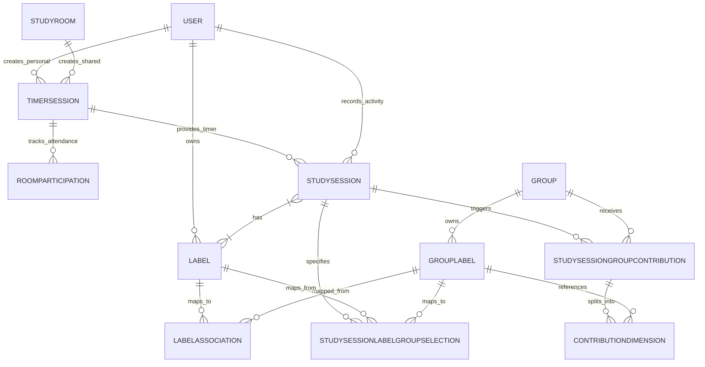

# StudySync Database Architecture

This document describes the final schema for the StudySync Timer, Analytics, and Labeling engines (Phase 3B.0).

## ERD (Core Timer and Analytics)

## Dictionary

- **User**: Standard user entity.
- **TimerMode**: Configuration for loops, durations, and stages.
- **TimerSession**: A running, pending, or paused timer. Historically owned by a `User` (personal) or a `StudyRoom` (shared room).
- **StudyRoom**: Shared study environment providing a `TimerSession`.
- **RoomParticipation**: Multiple non-contiguous intervals for a user in a room (`startedAt`, `endedAt`).
- **StudySession**: The user's actual historical focus time log. Has multiple `Label`s.
- **Label**: A user's personal taxonomy for studying.
- **GroupLabel**: A group's taxonomy.
- **LabelAssociation**: Relates a personal `Label` to a `GroupLabel`.
- **StudySessionGroupContribution**: An immutable snapshot denoting that a `StudySession` contributed a specific unique `durationSeconds` to a `Group`.
- **ContributionDimension**: An immutable record tracking which `GroupLabel`s (snapshotted via `groupLabelNameSnapshot`) were active for that group contribution.
- **StudySessionLabelGroupSelection**: Explicitly persists a user's decision to include (`isIncluded: true`) or exclude (`isIncluded: false`) a specific `Label` -> `GroupLabel` mapping for a particular `StudySession`, overriding the default `LabelAssociation`.

## Authorization & Deletion Rules

- **LabelAssociation**: Enforced at the service level. A user can only associate their own `Label` with a `GroupLabel` if they are an authorized member of that `Group`.
- **Group Deletion**: `Group` has `onDelete: Cascade` for `StudySessionGroupContribution`. Deleting a group removes its historical analytics, but the user's personal `StudySession` and analytics remain intact. Deleting a `GroupLabel` retains historical dimensions via `SetNull` and `groupLabelNameSnapshot`.
